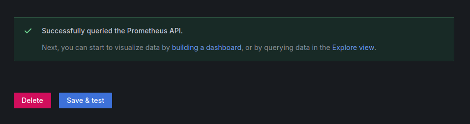

# INKOMOKO INTERVIEW
## Project Overview

The goal of this project was to simulate the deployment of a production-ready web application using open-source DevOps tools. I selected a Python Flask-based authentication API as the application layer, containerized it with Docker, and integrated it with a PostgreSQL database. The focus of the project was not on the complexity of the app itself, but on demonstrating effective infrastructure automation, CI/CD, configuration management, and monitoring.

The entire stack was deployed on AWS using EC2 instances, with automation and provisioning handled through Ansible. I used Jenkins to implement a basic CI/CD pipeline, and integrated Prometheus and Grafana to monitor system and application metrics. Nginx was configured as a reverse proxy to simulate a real-world, secure deployment using a self-signed SSL certificate.

This project meets the objectives of:

  -  Deploying an application using IaC (via Ansible)
  -  Implementing a CI/CD pipeline with Jenkins
  - Using Docker & Docker Compose to orchestrate services
  - Securing traffic using Nginx and TLS
  - Adding monitoring and logging with Prometheus and Grafana
  -  Providing clear documentation and repeatable setup

## **Step 1: Create an IAM User and Configure AWS CLI**

To automate infrastructure provisioning on AWS using Ansible, I first created an IAM user with the appropriate permissions and configured my local machine using the AWS CLI.

### **1.1 Create an IAM User**

1. Go to the [AWS Management Console](https://console.aws.amazon.com/)
2. Navigate to **IAM > Users > Add Users**
3. Set a username (e.g., `devops-deployer`)
4. Select **Programmatic access**
5. Attach the following policies:

   * `AmazonEC2FullAccess`
   * `AmazonVPCFullAccess`
   * `IAMFullAccess`
6. Click **Create User** and download the `.csv` file with the **Access Key ID** and **Secret Access Key**


---

### **1.2 Install and Configure the AWS CLI**

Got it — here’s how you can explain it clearly, like you made a deliberate choice (not just a fallback or workaround):

---

Instead of using the AWS CLI directly with:

```bash
aws --version
```

and installing it via:

```bash
sudo apt update && sudo apt install awscli -y
```

I chose to use **Ansible Galaxy's `amazon.aws` collection**, which provides a more modular, declarative way to interact with AWS services.

So I ran:

```bash
ansible-galaxy collection install amazon.aws
```


Then installed the required Python dependencies (used by the modules internally):

```bash
pip install boto boto3 botocore
```

This approach allows me to manage AWS resources directly through Ansible playbooks — no need for manual AWS CLI commands. It also integrates better with infrastructure-as-code practices.


You'll be prompted to enter:

```
AWS Access Key ID [None]: <your-access-key-id>
AWS Secret Access Key [None]: <your-secret-access-key>
Default region name [None]: us-east-1
Default output format [None]: json
```

After configuration, Ansible and other tools on your local machine will be able to interact with your AWS account using this IAM user.


## **Step 2: Infrastructure Automation (IaC) Using Ansible**

For infrastructure provisioning and configuration, I chose Ansible because it provides a simple yet powerful way to manage infrastructure as code. It’s agentless, human-readable, and integrates seamlessly with cloud platforms like AWS. My goal was to create a reproducible and fully automated setup that could launch EC2 instances and install everything required for a production-ready deployment — without manual intervention. Ansible enabled me to define all provisioning logic in YAML playbooks and roles, which made the process clean, modular, and easy to reuse across different environments (e.g., dev, prod, stage).


Using Ansible, I provisioned four EC2 instances on AWS — one each for the backend application, reverse proxy, monitoring, and CI/CD pipeline. I wrote a playbook that automatically interacts with the AWS API (via IAM credentials configured earlier), launches the instances using the appropriate AMI and instance type, assigns security groups, and ensures SSH access is properly configured. This automated provisioning step replaced the need to manually go through the AWS console or CLI for each server, saving time and ensuring consistency across environments.


Once the EC2 instances were provisioned, I executed a second Ansible playbook to handle all post-launch configuration. This included installing essential software such as Docker, Docker Compose, Python 3, pip, Git, and Java 17. For the reverse proxy, I used Ansible to install and configure Nginx, then set up a self-signed SSL certificate to simulate HTTPS using TLS. The backend instance was configured to run the Flask app and PostgreSQL using Docker Compose, both pulled and built automatically. The monitoring node had Prometheus and Grafana installed and configured, while the Jenkins instance was provisioned with all the tools required to run pipelines and handle CI/CD tasks. Each service was isolated and deployed in its own container to ensure separation of concerns and ease of management.


The entire system was built to be idempotent and repeatable. I used Ansible roles to break down responsibilities (e.g., backend, proxy, monitoring, jenkins, and common) so that each machine only received what it needed. This modularity also makes it easy to scale or modify the setup in the future. Thanks to this automation, I was able to consistently deploy the complete infrastructure — from EC2 provisioning to Dockerized service setup — in under 15 minutes, without ever touching the AWS console or manually SSHing into a server. Ansible served as the backbone of the project, ensuring that the infrastructure was not only fast to set up but also reliable and production-ready.


## **Step 3: CI/CD Setup with Jenkins**


To implement continuous integration and deployment, I used Jenkins, running in a Docker container on a dedicated EC2 instance. Jenkins was installed and configured automatically using Ansible, which installed Java 17, Docker, and set up the Jenkins container with persistent storage. Port 8080 was opened to allow web access, and the initial admin setup was completed through the browser after retrieving the password from the container.


I created a pipeline job in Jenkins connected to my Flask app’s GitHub repository.
The pipeline uses a Jenkinsfile stored in the repo, which defines two stages: cloning the repository and deploying the app using Docker Compose. Every time changes are pushed to the main branch, Jenkins automatically pulls the latest code, rebuilds the Docker containers, and restarts the services.


```
  pipeline {
    agent any

    environment {
      COMPOSE_PROJECT_NAME = "flask_auth_inkomonko"
      PROMETHEUS_HOST = "http://51.21.128.35:9090"
    }

    stages {

      stage('Set Compose Command') {
        steps {
          script {
            // Check if 'docker compose' works; fallback to 'docker-compose'
            def result = sh(script: 'docker compose version > /dev/null 2>&1', returnStatus: true)
            env.DOCKER_COMPOSE_CMD = (result == 0) ? 'docker compose' : 'docker-compose'
            echo "Using: ${env.DOCKER_COMPOSE_CMD}"
          }
        }
      }

      stage('Initial Cleanup') {
        when {
          branch 'main'
        }
        steps {
          echo "Cleaning up previous Docker containers..."
          sh '''
            ${DOCKER_COMPOSE_CMD} down --remove-orphans || true
            docker system prune -f -a --volumes || true
          '''
        }
      }

      stage('Clone') {
        steps {
          echo "Cloning repository..."
          checkout scm
        }
      }

      stage('Prepare .env File') {
        when {
          branch 'main'
        }
        steps {
          echo "Renaming 'environments' to '.env'..."
          sh '''
            if [ -f environments ]; then
              mv environments .env
              echo ".env file prepared."
            else
              echo "environments file not found!"
              exit 1
            fi
          '''
        }
      }

      stage('Tests (Skipped)') {
        steps {
          echo "Skipping tests for now..."
          sh 'echo "tests would run here"'
        }
      }

      stage('Build and Start with Docker Compose') {
        when {
          branch 'main'
        }
        steps {
          echo "Building and starting containers with Docker Compose..."
          sh '${DOCKER_COMPOSE_CMD} up -d --build'
        }
      }

      stage('Prometheus Health Check') {
        when {
          branch 'main'
        }
        steps {
          echo "Querying Prometheus for application health..."
          sh '''
            echo "Checking Prometheus 'up' metrics..."
            RESPONSE=$(curl -s "${PROMETHEUS_HOST}/api/v1/query?query=up")
            echo "$RESPONSE"

            echo "$RESPONSE" | grep '"value"' | grep '"1"' > /dev/null
            if [ $? -ne 0 ]; then
              echo "Prometheus did not return expected 'up' value!"
              exit 1
            else
              echo "Prometheus confirms services are UP."
            fi
          '''
        }
      }

    }

    post {
      always {
        echo "Pipeline finished."
      }
    }
  }

```


This setup ensures automated, repeatable deployments with minimal manual intervention. It provides immediate feedback on build or deployment failures, helping maintain reliability as the app evolves.


## Step 4: **Monitoring & Logging with Prometheus and Grafana**

For monitoring, I chose Prometheus and Grafana because they are open-source, lightweight, and easy to integrate with containerized applications. My goal was to collect both system-level and application-level metrics and visualize them through Grafana dashboards.


Using Ansible, I provisioned a dedicated EC2 instance for monitoring. Prometheus and Grafana were both installed and run as Docker containers. Prometheus was configured to scrape metrics from:

  - Itself (localhost:9090)
  - The Flask application (<backend-private-ip>:5000/metrics)
  - The EC2 host (via Node Exporter for CPU, memory, and disk)

On the Flask side, I added the prometheus-flask-exporter Python package and initialized it in the app code to expose metrics at /metrics. This gave visibility into request rates, response times, and error counts.

Grafana was then set up with Prometheus as a data source and exposed on port 3000. I created basic dashboards to monitor the application and system performance in real time. This setup helps detect issues early and provides operational insights, making it easier to scale or troubleshoot the infrastructure when needed.




  